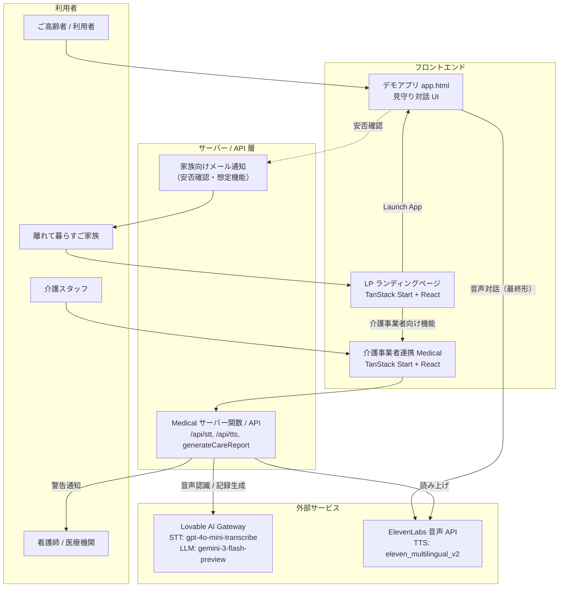
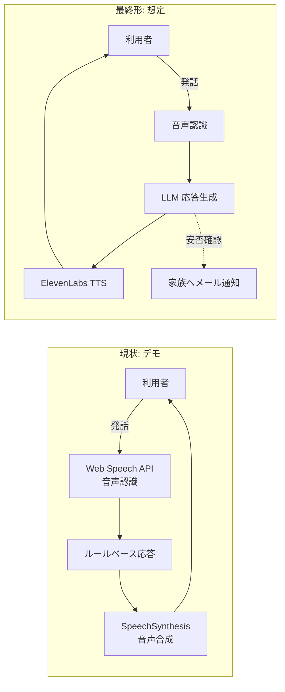
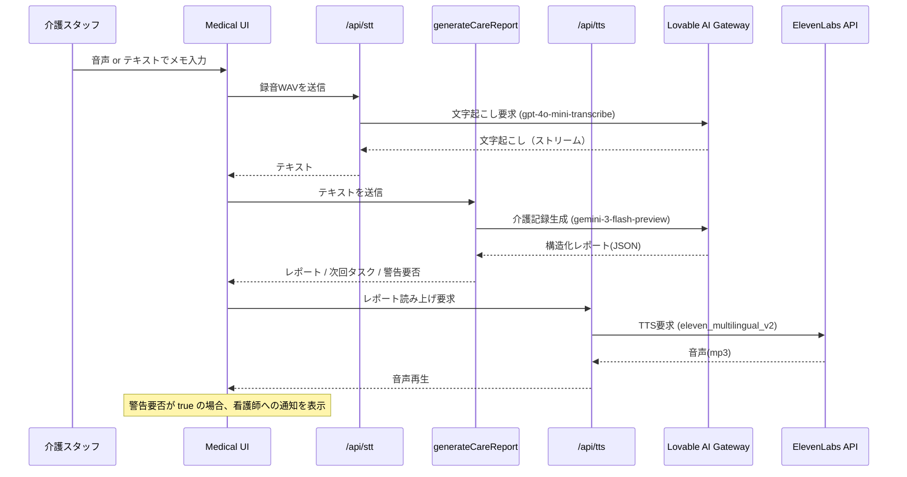

# システム構成図（想定）

> 本ドキュメントは開発途中時点での「想定されるシステム構成」を示すものです。

## 1. システム概要

離れて暮らすご高齢のご家族の安否を、サメのマスコット「ジョーズくん」との音声・テキスト対話でそっと見守るサービスです。あわせて、介護事業者が日々のケアを効率化・医療機関と連携するための機能を備えます。

システムは大きく 3 つのフロントと、それを支える外部 AI/音声サービス群で構成されます。

- **デモアプリ（`app.html`）** … 利用者（ご高齢者）が対話する見守りアプリ本体。現状はブラウザ標準の音声機能によるデモ。最終的には ElevenLabs 音声 API を採用予定。

- **介護事業者連携（`Medical/`）** … 介護スタッフのメモ・音声を専門的な介護記録に変換し、医療機関（看護師）との連携を支援する機能。

## 2. 全体システム構成図

## 3. 構成要素の詳細

### 3.1 デモアプリ（`app.html`）

利用者が「ジョーズくん」と会話する見守りアプリの本体です。単一の HTML ファイルで完結し、GitHub Pages 上でホストされています（`https://nandemotoken.github.io/mimamori_jaws/app.html`）。

- **現状（デモ実装）**
  - 音声入力: ブラウザ標準の `Web Speech API`（`SpeechRecognition`）
  - 音声出力: ブラウザ標準の `SpeechSynthesis`
  - 応答生成: キーワードマッチによるルールベース応答（`responses` / `fallbacks`）
- **最終形（想定）**
  - 音声出力を **ElevenLabs 音声 API** に置き換え、より自然でキャラクター性のある声で「ジョーズくん」が話す
  - 応答生成を LLM ベースに拡張する余地あり
  - 対話結果をもとに **ご家族へメール通知（安否確認）** する連携を追加想定

### 3.2 LP（`LP/`）

サービスの世界観と 3 つの価値（話しかけ / 家族へ通知 / 介護記録の自動生成）を伝えるランディングページです。

- 技術スタック: `TanStack Start` + `React 19` + `TanStack Router` + `Tailwind CSS` + `shadcn/ui`
- 多言語対応（日本語 / 英語、`LP/src/lib/i18n.tsx`）
- ページ: トップ / サービス概要 / 機能 / お問い合わせ
- 導線: デモアプリ（`app.html`）および介護事業者向け機能（Medical）への入口

### 3.3 介護事業者連携（`Medical/`）

介護スタッフの口頭メモやテキストを、専門的な介護記録に変換し、医療機関（看護師）との連携を支援します。

- 技術スタック: `TanStack Start` + `React 19` + `Tailwind CSS` + `Zod`
- 主要な処理フロー:
  1. **音声入力（STT）**: 録音した音声を `/api/stt` に送信 → Lovable AI Gateway（`openai/gpt-4o-mini-transcribe`）で文字起こし（ストリーミング返却）
  2. **記録生成（LLM）**: テキストを `generateCareReport` サーバー関数へ → Lovable AI Gateway（`google/gemini-3-flash-preview`）で専門的な介護記録・次回タスク・警告要否を JSON 生成
  3. **読み上げ（TTS）**: 生成レポートを `/api/tts` に送信 → **ElevenLabs 音声 API**（`eleven_multilingual_v2`）で音声化
  4. **医療機関連携**: バイタル異常・転倒・出血・意識障害など、看護師への通知が必要なケースを `alert_required` として検知し警告表示

## 4. 外部サービス

- **Lovable AI Gateway** … `Medical` の音声認識（`gpt-4o-mini-transcribe`）と介護記録生成（`gemini-3-flash-preview`）に利用。`LOVABLE_API_KEY` で認証。
- **ElevenLabs 音声 API** … 高品質な音声合成（`eleven_multilingual_v2`）。`Medical` のレポート読み上げに利用中。**デモアプリ（`app.html`）も最終的に本 API に置き換え予定**。`ELEVENLABS_API_KEY` で認証。
- **メール通知サービス（想定）** … ご家族への安否確認メール送信。現時点では未実装で、今後の追加を想定。

## 5. 技術スタックまとめ

- フロントエンド: `React 19`, `TanStack Start`, `TanStack Router`, `Tailwind CSS v4`, `shadcn/ui`
- サーバー: `TanStack Start` サーバー関数 / API ルート（`Nitro` ランタイム）
- デモアプリ: 単一 HTML + Vanilla JS（GitHub Pages ホスティング）
- バリデーション: `Zod`
- 外部 AI/音声: Lovable AI Gateway、ElevenLabs

## 6. 環境変数

- `LOVABLE_API_KEY` … Lovable AI Gateway（STT / LLM）用
- `ELEVENLABS_API_KEY` … ElevenLabs 音声 API（TTS）用

---

> 注記: 本構成図は開発途中時点での想定です。特にデモアプリ（`app.html`）の音声出力の ElevenLabs 化、および家族向けメール通知は今後実装予定の要素です。
